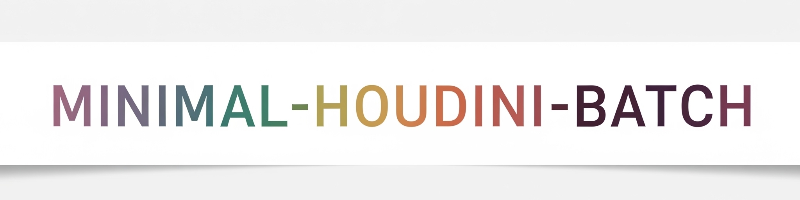

# Minimal-Houdini-Batch

シンプルなHoudiniのWindowsバッチ動作用の構成

## セットアップ

1.  **リポジトリのクローンまたはダウンロード:**

    任意の場所にクローンまたはダウンロードしてください。

## 使い方

セットアップ完了後、以下の手順でバッチのテストが可能です。

1.  **launch.bat の [Houdiniインストールディレクトリ] を自身のHoudiniのパスに置き換える**

2. pipeline.hipを開き`topnet1/filepattern1`のパターンを動作対象にしたいディレクトリに変更する
   (サンプルでは`D:/resource`以下のfbxをすべて参照する形になっています。)

3.  **launch.bat を実行**

## 各ファイルについて

ファイルとディレクトリのそれぞれの役割は以下の通りです。

* `docs/`:README.md等で利用される関連ファイル
  * `/images/`: README.md等で利用される画像ファイル
* `hip/`:TOPで処理を行うためのサンプルシーンを格納
* `scripts/`: パイプラインで実行されるPython等のスクリプト
  * `/python/`: 
    * `/exec_on_houdini.py`: batからhoudiniに渡されるTOPを実行するためのスクリプト
    * `/node_scripts/`: 
      * `/export_detail_attr_to_json.py`: pipeline.hipに含まれる、detailアトリビュートをjsonとして出力するpythonノードに記載されたコード

## 管理者

このリポジトリに関するご質問、不具合の報告、または改善提案などがありましたら、以下の連絡先にご連絡ください。

* プロジェクトメンテナー: 
    - [Maneki Pipeline/ FishBall](https://www.procedural.jp/)
* お問い合わせ先: [Maneki Pipeline/ 連絡先](https://www.procedural.jp/articles/rsfyqf0k3hdc)

---